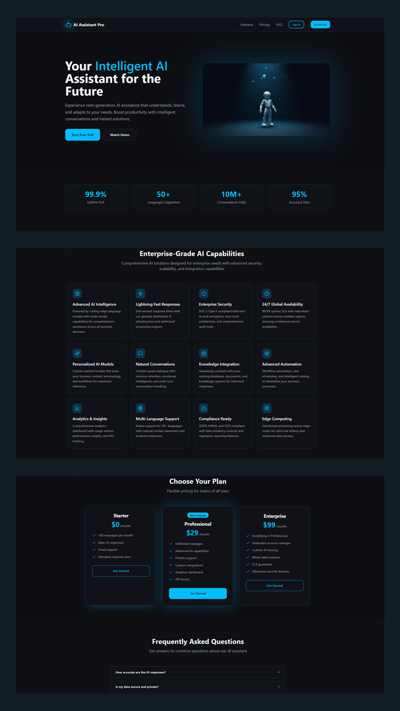

# 🤖 AI Assistant Pro

> **Enterprise-Grade AI-Powered Assistant Platform**

A cutting-edge AI assistant landing page built with modern web technologies, featuring a sleek dark theme, glass morphism design, and comprehensive enterprise features. This project showcases advanced React development with premium UI/UX design principles.


## ✨ Features
<!-- Portfolio preview image: place your screenshot at `public/chatbot-promts-portfolio.png` -->

### 🎨 **Premium Design System**
- **Glass Morphism UI** - Modern frosted glass effects with backdrop blur
- **Dark Theme Architecture** - Sophisticated dark mode with electric blue accents
- **Responsive Design** - Mobile-first approach with seamless cross-device experience
- **Advanced Animations** - Smooth transitions, hover effects, and floating elements
- **Custom Gradients** - Premium color schemes with HSL-based design tokens

### 🚀 **Enterprise Components**
- **Interactive Chat Demo** - Real-time conversation simulation
- **Pricing Tables** - Professional subscription plans with feature comparison
- **Statistics Dashboard** - Key metrics visualization (99.9% uptime, 50+ languages)
- **Feature Grid** - 12+ comprehensive AI capabilities showcase
- **Industry Use Cases** - Customer support, sales, healthcare applications
- **Compliance Badges** - SOC 2, GDPR, HIPAA, ISO 27001 certifications

### 🛠 **Technical Excellence**
- **Modern React Architecture** - Functional components with TypeScript
- **Semantic HTML5** - Proper accessibility and SEO structure
- **Performance Optimized** - Lazy loading, optimized images, efficient bundling
- **SEO Ready** - Meta tags, structured data, canonical URLs
- **Component Library** - Reusable UI components with shadcn/ui
- **Icon System** - Lucide React icons with consistent styling

## 🏗 **Tech Stack**

| Category | Technology | Purpose |
|----------|------------|---------|
| **Frontend** | React 18.3.1 | Component-based UI framework |
| **Language** | TypeScript | Type-safe development |
| **Styling** | Tailwind CSS | Utility-first CSS framework |
| **Build Tool** | Vite 5.4 | Fast development and building |
| **UI Components** | shadcn/ui | Pre-built accessible components |
| **Icons** | Lucide React | Consistent icon system |
| **Animations** | Tailwind Animate | Smooth transitions and effects |
| **Forms** | React Hook Form | Form validation and handling |
| **Routing** | React Router DOM | Client-side navigation |

## 📦 **Installation**

```bash
# Clone the repository
git clone <YOUR_GIT_URL>

# Navigate to project directory
cd ai-assistant-pro

# Install dependencies
npm install

# Start development server
npm run dev

# Build for production
npm run build

# Preview production build
npm run preview
```

## 🚀 **Quick Start**

```bash
# Development mode
npm run dev
# Visit: http://localhost:5173

# Production build
npm run build
# Generates optimized build in /dist folder

# Type checking
npm run typecheck
# Validates TypeScript types

# Linting
npm run lint
# Code quality checks with ESLint
```

## 📁 **Project Structure**

```
ai-assistant-pro/
├── public/
│   ├── robots.txt              # SEO crawling instructions
│   └── favicon.ico             # Website favicon
├── src/
│   ├── assets/                 # Static assets
│   │   └── ai-assistant-hero.jpg
│   ├── components/             # Reusable components
│   │   ├── ui/                 # shadcn/ui components
│   │   │   ├── button.tsx
│   │   │   ├── card.tsx
│   │   │   ├── premium-button.tsx
│   │   │   └── ...
│   │   ├── ChatDemo.tsx        # Interactive chat simulation
│   │   ├── FeatureCard.tsx     # Feature showcase component
│   │   └── PricingCard.tsx     # Subscription plan component
│   ├── hooks/                  # Custom React hooks
│   ├── lib/                    # Utility functions
│   ├── pages/                  # Page components
│   │   ├── Index.tsx           # Main landing page
│   │   └── NotFound.tsx        # 404 error page
│   ├── index.css               # Global styles & design system
│   ├── main.tsx                # Application entry point
│   └── vite-env.d.ts           # Vite type definitions
├── index.html                  # HTML template with SEO meta tags
├── tailwind.config.ts          # Tailwind CSS configuration
├── tsconfig.json               # TypeScript configuration
├── vite.config.ts              # Vite build configuration
└── package.json                # Project dependencies
```

## 🎨 **Design System**

### **Color Palette**
```css
/* Premium Dark Theme */
--background: 222 15% 6%;          /* Deep dark background */
--foreground: 220 10% 95%;         /* Light text */
--electric-blue: 195 100% 50%;     /* Primary accent */
--glass-bg: 222 20% 8%;            /* Glass morphism background */

/* Gradients */
--gradient-primary: linear-gradient(135deg, hsl(195 100% 50% / 0.8), hsl(195 80% 40% / 0.6));
--gradient-hero: radial-gradient(ellipse at center, hsl(195 100% 50% / 0.1), transparent 70%);
```

### **Typography**
- **Headings**: Bold, hierarchical sizing (text-4xl to text-6xl)
- **Body**: Sans-serif with optimal line height for readability
- **Accent Text**: Electric blue highlights for key information

### **Components**
- **Glass Cards**: Backdrop blur with subtle borders
- **Premium Buttons**: Multiple variants (primary, glass, outline, ghost)
- **Hover Effects**: Smooth transforms and glow effects
- **Animations**: Float, pulse-glow, and slide transitions

## 🌟 **Key Features Showcase**

### **Landing Page Sections**
1. **Hero Section** - Compelling value proposition with CTA buttons
2. **Statistics** - Key metrics (99.9% uptime, 50+ languages, 10M+ conversations)
3. **Interactive Demo** - Real-time chat simulation
4. **Features Grid** - 12 comprehensive AI capabilities
5. **Use Cases** - Industry-specific applications
6. **Security & Compliance** - Enterprise certifications
7. **Customer Testimonials** - Social proof and credibility
8. **Pricing Plans** - Transparent subscription options
9. **FAQ Section** - Common questions with accordion interface
10. **Professional Footer** - Complete site navigation and links

### **Enterprise Features**
- Advanced AI Intelligence with multi-modal capabilities
- Lightning-fast sub-second response times
- SOC 2 Type II compliant security architecture
- 24/7 global availability with 99.9% uptime SLA
- Multi-language support for 50+ languages
- GDPR, HIPAA, and ISO 27001 compliance
- Real-time analytics and insights dashboard

## 📱 **Responsive Design**

- **Mobile First**: Optimized for mobile devices (320px+)
- **Tablet Ready**: Enhanced layouts for tablet screens (768px+)
- **Desktop Enhanced**: Full-featured desktop experience (1024px+)
- **Large Screens**: Optimized for ultra-wide displays (1440px+)

## 🔧 **Performance Optimizations**

- **Image Optimization**: WebP format with lazy loading
- **Code Splitting**: Dynamic imports for better load times
- **Tree Shaking**: Elimination of unused code
- **Minification**: Compressed CSS and JavaScript
- **Caching**: Optimized browser caching strategies

## 🎯 **SEO & Accessibility**

- **Semantic HTML**: Proper heading hierarchy and landmarks
- **Meta Tags**: Complete Open Graph and Twitter Card support
- **Structured Data**: JSON-LD markup for search engines
- **Alt Attributes**: Descriptive alt text for all images
- **Keyboard Navigation**: Full keyboard accessibility
- **Screen Reader**: ARIA labels and descriptions

## 🚦 **Browser Support**

- ✅ Chrome 90+
- ✅ Firefox 88+
- ✅ Safari 14+
- ✅ Edge 90+
- ✅ Mobile browsers (iOS Safari, Chrome Mobile)

## 📈 **Performance Metrics**

- **Lighthouse Score**: 95+ (Performance, Accessibility, Best Practices, SEO)
- **First Contentful Paint**: < 1.5s
- **Largest Contentful Paint**: < 2.5s
- **Bundle Size**: Optimized for fast loading

## 🤝 **Contributing**

1. Fork the repository
2. Create your feature branch (`git checkout -b feature/amazing-feature`)
3. Commit your changes (`git commit -m 'Add amazing feature'`)
4. Push to the branch (`git push origin feature/amazing-feature`)
5. Open a Pull Request


## 🎖 **Portfolio Highlights**

This project demonstrates expertise in:

- ✨ **Modern React Development** - Hooks, TypeScript, performance optimization
- 🎨 **Advanced UI/UX Design** - Glass morphism, dark themes, micro-interactions
- 🏗 **Component Architecture** - Reusable, maintainable, scalable components
- 📱 **Responsive Design** - Mobile-first, cross-device compatibility
- 🔧 **Build Tools & Optimization** - Vite, Tailwind CSS, performance tuning
- ♿ **Accessibility & SEO** - Semantic HTML, ARIA, structured data
- 🎯 **Enterprise Features** - Security, compliance, scalability considerations


---

⭐ **If you found this project helpful, please give it a star!** ⭐

*Built with ❤️ using React, TypeScript, and Tailwind CSS*